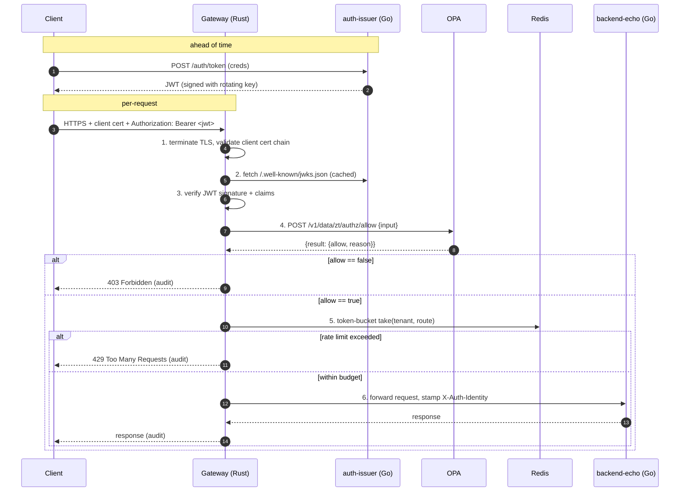

# Architecture

## Per-request flow



## Policy input contract

The gateway calls OPA with this `input` shape:

```json
{
  "method": "POST",
  "path": ["tenants", "acme", "users"],
  "tenant": "acme",
  "claims": {
    "sub": "alice",
    "iss": "https://auth.local",
    "tenant": "acme",
    "roles": ["user"],
    "country": "GR"
  },
  "client_ip": "203.0.113.10",
  "client_cert_subject": "CN=client-1,O=acme"
}
```

Rego policies under `policies/` produce a `data.zt.authz` package
with rules of the form:

```rego
package zt.authz
default allow := false
allow if { ... }
```

Three sample rules ship in v0.1:
- `tenants.rego` — a request can only touch resources belonging to
  the JWT's tenant claim.
- `methods.rego` — `GET` allowed for any valid identity; `POST` /
  `PUT` / `DELETE` require `roles` containing `admin`.
- `geo.rego` — JWTs from blocked country codes are rejected
  outright.

## Rate limiting

Per `(tenant, route)` token-bucket with Redis backing for horizontal
scaling. Default: **100 req/min**, burst **20**. Both come from
config; per-route overrides land via Rego policy data later.

## mTLS

Both edges are required:
- **Server cert** — gateway presents `server.crt`, signed by the
  internal CA.
- **Client cert** — gateway requires it via `tls.ClientAuth =
  RequireAndVerifyClientCert` and validates the chain against the
  same CA bundle.

Dev certs are generated by `scripts/gen-certs.sh` and gitignored;
prod uses cert-manager / ACM PCA / equivalent.

## Audit log

Every request emits one structured JSON line with:

```
{ "ts": "...", "request_id": "uuid",
  "client_ip": "...", "client_cert_subject": "...",
  "tenant": "...", "subject": "...",
  "method": "GET", "path": "/tenants/acme/users",
  "decision": "allow|deny|rate_limited",
  "reason": "policy:methods.allow_admin",
  "upstream_status": 200, "duration_ms": 12 }
```

Audit log streams to stdout for Compose and to Loki / CloudWatch /
Cloud Logging in cloud deployments. Grafana dashboards aggregate it
for ops review.

## Why these languages

- **Rust** for the gateway. The hot path is per-request — token
  parsing, OPA RPC, rate-limit math — and runs in front of the
  internet. Rust's memory safety + zero-cost abstractions are the
  textbook fit; `axum + tower` give clean middleware composition.
- **Go** for `auth-issuer` and `backend-echo`. Both are
  request/response HTTP services with library-driven crypto; Go's
  stdlib + ecosystem (golang-jwt, net/http) make them three-page
  programs.
- **Rego** for policies. The whole point of this repo is to keep
  authorization out of code; Rego is the open standard.

## Out of scope (v0.1)

- Real cloud `terraform apply` — modules ship as a skeleton; running
  them needs credentials this repo deliberately doesn't carry.
- WebAuthn / SAML / SSO — out of scope for "gateway" framing.
- Service-mesh integration (Envoy filter, Istio AuthorizationPolicy
  generation from the same Rego). Worth a follow-up.
