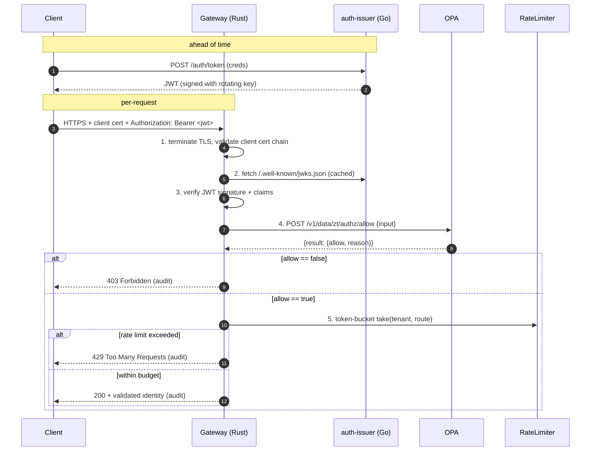

# Architecture

## Per-request flow



The gateway is a **policy enforcement endpoint**: every protected
route runs the full mTLS → JWT → OPA → rate-limit chain and, on
success, returns the validated identity. The companion
[`backend-echo`](services/backend-echo) service shows the
downstream pattern — it consumes `X-Auth-*` headers and echoes them
back, demonstrating how a real upstream would receive the stamped
identity once the gateway is fronting it.

## Policy input contract

The gateway calls OPA with this `input` shape:

```json
{
  "method": "POST",
  "path": ["tenants", "acme", "users"],
  "tenant": "acme",
  "claims": {
    "sub": "alice",
    "iss": "https://auth.local",
    "tenant": "acme",
    "roles": ["user"],
    "country": "GR"
  },
  "client_ip": "203.0.113.10",
  "client_cert_subject": "CN=client-1,O=acme"
}
```

Rego policies under `policies/` produce a `data.zt.authz` package
with rules of the form:

```rego
package zt.authz
default allow := false
allow if { ... }
```

Three sample rules ship under `policies/`:
- `tenants.rego` — a request can only touch resources belonging to
  the JWT's tenant claim.
- `methods.rego` — `GET` allowed for any valid identity; `POST` /
  `PUT` / `DELETE` require `roles` containing `admin`.
- `geo.rego` — JWTs from blocked country codes are rejected
  outright.

## Rate limiting

Per `(tenant, route)` fixed-window counter. The `RateLimiter` enum
dispatches to one of two backends, picked at startup from env:

- `InMemoryRateLimiter` — single-process counter; default when
  `GATEWAY_REDIS_URL` is unset.
- `RedisRateLimiter` — atomic `INCR` + `EXPIRE` against a shared
  Redis. Fails open on connection errors so a flaky cache can't
  take the data plane down.

Default budget: **100 req/min** per key. Both backends expose the
same `check(key) -> Result<remaining, retry_after_secs>` signature
so the middleware doesn't know which one is wired.

## mTLS

Both edges are required:
- **Server cert** — gateway presents `server.crt`, signed by the
  internal CA.
- **Client cert** — gateway requires it via `tls.ClientAuth =
  RequireAndVerifyClientCert` and validates the chain against the
  same CA bundle.

Dev certs are generated by `scripts/gen-certs.sh` and gitignored;
prod uses cert-manager / ACM PCA / equivalent.

## Audit log

Every request emits one structured JSON line with:

```
{ "ts": "...", "request_id": "uuid",
  "client_ip": "...", "client_cert_subject": "...",
  "tenant": "...", "subject": "...",
  "method": "GET", "path": "/tenants/acme/users",
  "decision": "allow|deny|rate_limited",
  "reason": "policy:methods.allow_admin",
  "upstream_status": 200, "duration_ms": 12 }
```

Audit log streams to stdout for Compose and to Loki / CloudWatch /
Cloud Logging in cloud deployments. Grafana dashboards aggregate it
for ops review.

## Why these languages

- **Rust** for the gateway. The hot path is per-request — token
  parsing, OPA RPC, rate-limit math — and runs in front of the
  internet. Rust's memory safety + zero-cost abstractions are the
  textbook fit; `axum + tower` give clean middleware composition.
- **Go** for `auth-issuer` and `backend-echo`. Both are
  request/response HTTP services with library-driven crypto; Go's
  stdlib + ecosystem (golang-jwt, net/http) make them three-page
  programs.
- **Rego** for policies. The whole point of this repo is to keep
  authorization out of code; Rego is the open standard.

## Design choices and extension points

- **Terraform without `apply`.** The IaC modules ship as runnable
  skeletons. Standing up real infrastructure needs cloud credentials
  that this repo deliberately doesn't carry; the modules are still
  the contract for what the deploy looks like.
- **No WebAuthn / SAML / SSO.** The gateway is a JWT consumer, not
  an identity provider; user-facing federation belongs upstream of
  `auth-issuer`.
- **No service-mesh integration today.** The same Rego policies could
  be served to an Envoy filter or compiled to an Istio
  AuthorizationPolicy — both reuse the existing `policies/` tree
  unchanged.
